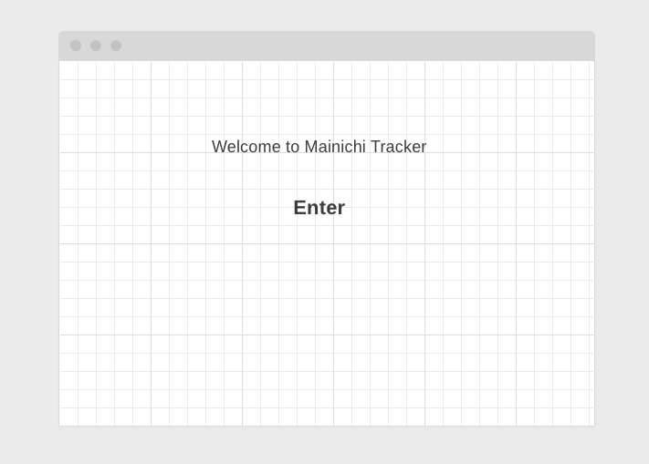
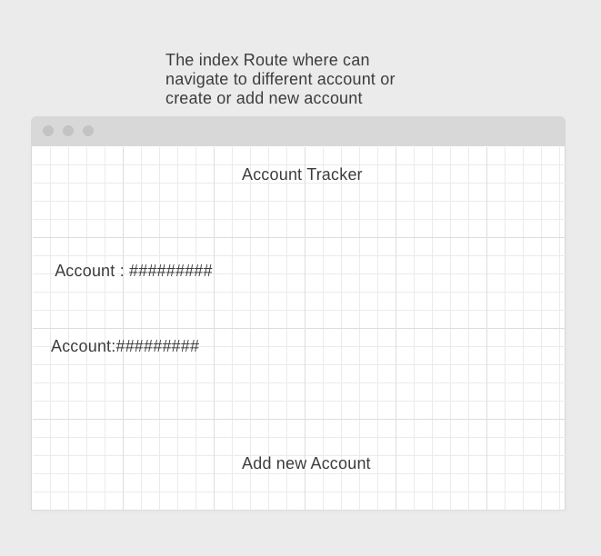
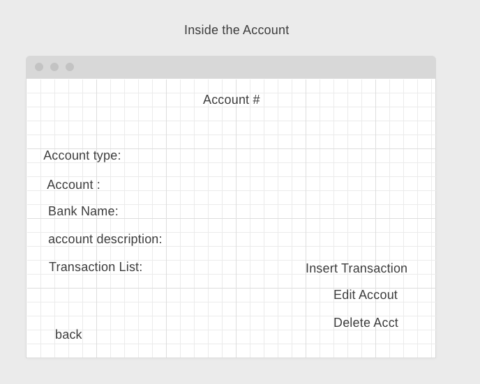
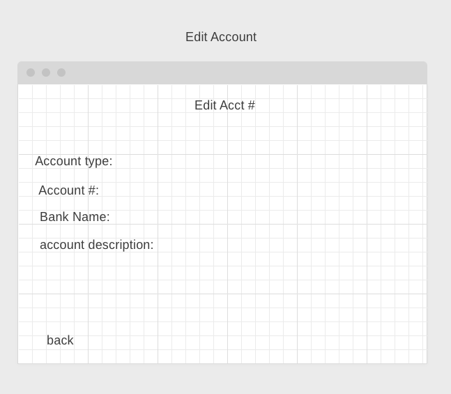
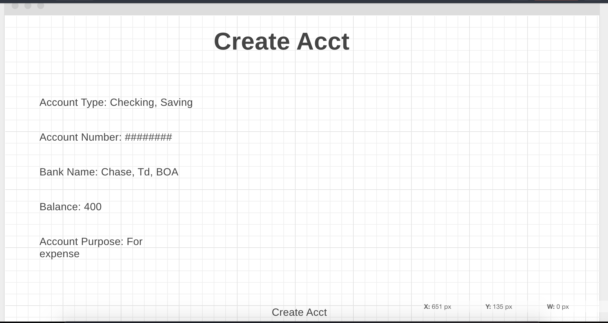
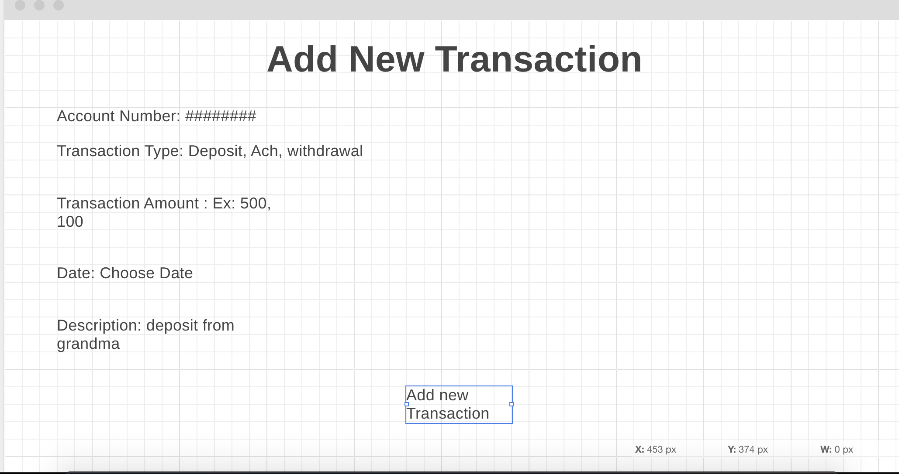
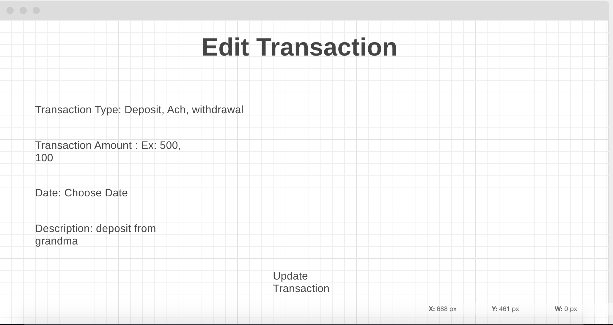
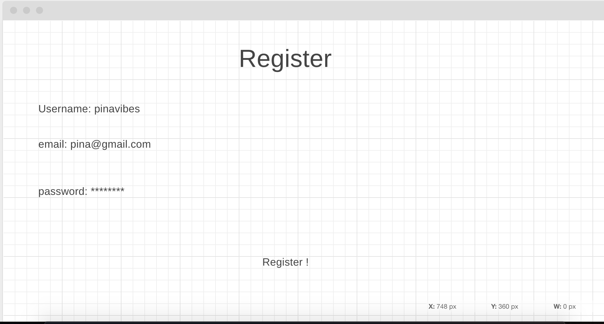
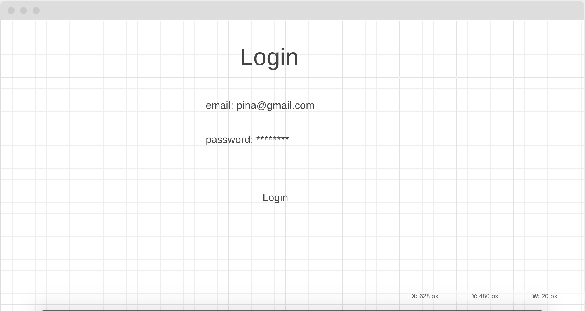

# Mainichi Tracker

Mainichi is a account register that user can create different bank account and adding transactions to the specific account. It help user to be able to keep track on what they have spent on and is an extra check to compare with bank statements.

## Dependecies

- express
- body-parser
- mongoose
- ejs
- method-override
- connect-mongo
- express-session
- bcrypt

## WireFrames

### Home Route

### All Account List

### Specific Account Show Route

### Edit Acct Info route

### Create acct route

### Add New Transaction Route

### Update Transaction Route

### Register Route

### Login Route

